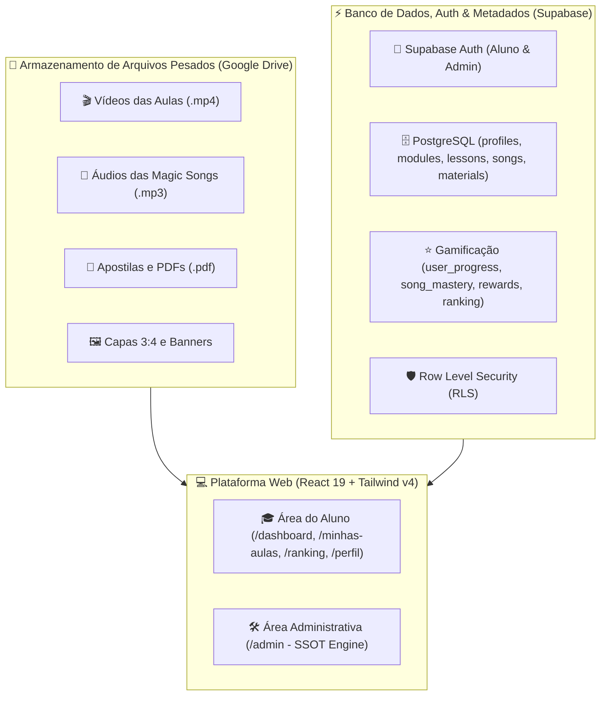

# 🎓 Magic English — Plataforma Educacional de Inglês com Fixação Musical 🎵✨

[](https://react.dev/)
[](https://vitejs.dev/)
[](https://tailwindcss.com/)
[](https://supabase.com/)
[](https://drive.google.com/)

O **Magic English** é uma plataforma inovadora de aprendizado da língua inglesa que combina **aulas em vídeo cinematográficas estilo streaming** com um **método musical exclusivo de memorização e fixação profunda**. 

Inspirado na interface imersiva da **Netflix/Prime Video**, no engajamento gamificado do **Duolingo**, no player musical do **Spotify** e na estrutura educacional da **Kiwify**.

---

## 🌟 Diferenciais do Método Magic English

O aprendizado acontece de ponta a ponta através de 5 etapas integradas:
1. 🎬 **Vídeo da Aula:** Explicação conceitual e imersão contextual.
2. 🎵 **Magic Song:** Música original criada especificamente para fixar o vocabulário e estruturas.
3. 📖 **Letra com Tradução Sincronizada:** Karaokê interativo com acompanhamento de versos em tempo real.
4. 🎤 **Voice Lab (Treino de Pronúncia):** Reconhecimento de fala e conexão de ritmo/sons.
5. 🧠 **Prática Musical Reversa:** Tradução rápida do Português para o Inglês com reforço e ganho de **Magic XP**.

---

## 🏛️ Arquitetura do Sistema

Para máxima performance, segurança e redução de custos operacionais, o Magic English opera em uma arquitetura híbrida inteligente:



* **Google Drive:** Hospedagem econômica de arquivos pesados (vídeos HD, MP3s masterizados e PDFs).
* **Supabase (PostgreSQL + Auth):** Autenticação segura com separação de perfis (*Student* vs *Admin*), controle de progresso, ranking semanal em tempo real e relações SSOT (*Single Source of Truth*).
* **Cadastro Único (SSOT):** O administrador cadastra uma Magic Song uma única vez e o sistema alimenta automaticamente o Player Karaokê, o Voice Lab de Pronúncia, a Prática Musical e a Central de Materiais.

---

## 🚀 Como Instalar e Executar

### Pré-requisitos
* **Node.js:** Versão 18.0 ou superior
* **npm** ou **yarn** / **pnpm**

### 1. Clonar o repositório
```bash
git clone https://github.com/Peregrino1508/Google-Antigravity.git
cd "Curso de ingles"
```

### 2. Instalar as dependências
```bash
npm install
```

### 3. Configurar as Variáveis de Ambiente
Crie um arquivo `.env` na raiz do projeto (baseado em `.env.example`):
```bash
cp .env.example .env
```

Preencha com as credenciais do seu projeto Supabase:
```env
VITE_SUPABASE_URL=https://seu-projeto.supabase.co
VITE_SUPABASE_ANON_KEY=sua-anon-key-aqui
```

### 4. Executar em Modo de Desenvolvimento
```bash
npm run dev
```
Acesse a aplicação em `http://localhost:5173`.

### 5. Compilar para Produção (Build)
```bash
npm run build
```

---

## 📂 Estrutura de Pastas do Projeto

```text
Curso de ingles/
├── public/                     # Imagens estáticas e assets públicos
├── supabase/
│   └── schema.sql              # Script SQL completo (Tabelas, RLS, Triggers e Seeds)
├── src/
│   ├── assets/                 # Recursos gráficos locais
│   ├── components/
│   │   ├── admin/              # Painel Administrativo e Gestão SSOT
│   │   │   ├── AdminDashboard.jsx
│   │   │   ├── AdminLayout.jsx
│   │   │   ├── AdminSidebar.jsx
│   │   │   ├── GamificationManager.jsx
│   │   │   ├── LessonManager.jsx
│   │   │   ├── MaterialManager.jsx
│   │   │   ├── ModuleManager.jsx
│   │   │   ├── PronunciationManager.jsx
│   │   │   ├── SongManager.jsx
│   │   │   └── StudentManager.jsx
│   │   ├── auth/               # Autenticação e Onboarding
│   │   │   ├── AdminLogin.jsx
│   │   │   ├── ForgotPassword.jsx
│   │   │   ├── LoginStudent.jsx
│   │   │   ├── Onboarding.jsx
│   │   │   ├── ProtectedRoute.jsx
│   │   │   ├── RegisterStudent.jsx
│   │   │   └── StudentProfileSetup.jsx
│   │   ├── classroom/          # Magic Classroom (Vídeos + Abas)
│   │   ├── dashboard/          # Home do Aluno (Hero Full Width, Estatísticas, Trilhas)
│   │   ├── gamification/       # XP, Badges, Níveis e Recompensas
│   │   ├── layout/             # Header, Sidebar e RightPanel
│   │   ├── materials/          # Central de Download de Materiais e PDFs
│   │   ├── modules/            # Catálogo de Módulos (Cards Verticais 3:4)
│   │   ├── player/             # Magic Song Karaokê Player
│   │   ├── practice/           # 4-Step Musical Practice Lab
│   │   ├── profile/            # Perfil Gamificado do Aluno
│   │   ├── pronunciation/      # Voice Lab de Pronúncia
│   │   ├── ranking/            # Magic Ranking & Sistema de Ligas
│   │   ├── tracks/             # Trilhas de Aprendizado
│   │   └── ui/                 # Modais e Componentes Reutilizáveis
│   ├── context/
│   │   ├── AuthContext.jsx     # Gestão de Sessão, Perfis e Preparação Kiwify
│   │   └── GamificationContext.jsx # Gestão de XP, Streak, Badges e Level-up
│   ├── data/                   # Datasets de apoio e fallback
│   ├── hooks/                  # Custom Hooks (useMediaPlayback, useDebounce)
│   ├── lib/
│   │   └── supabaseClient.js   # Conector do cliente Supabase
│   ├── services/               # Repositórios e Serviços de Dados
│   │   ├── lessonsService.js
│   │   ├── materialsService.js
│   │   ├── modulesService.js
│   │   ├── progressService.js
│   │   ├── rankingService.js
│   │   ├── songsService.js
│   │   └── storageService.js
│   ├── utils/
│   │   └── googleDriveHelper.js # Conversor inteligente de URLs do Drive
│   ├── App.jsx                 # Roteador Principal e Guarda de Acesso
│   ├── main.jsx                # Ponto de Entrada React
│   └── index.css               # Configuração Tailwind CSS v4
├── .env.example                # Modelo de variáveis de ambiente
├── .gitignore                  # Arquivos e pastas ignorados no versionamento
├── package.json                # Dependências e scripts do projeto
├── vite.config.js              # Configuração do Vite
└── README.md                   # Documentação oficial
```

---

## 🌿 Estratégia de Branches & Versionamento Git

O projeto adota o fluxo de trabalho **Gitflow** simplificado:

* `main` — Branch principal estável e pronta para produção / deploy.
* `develop` — Branch de integração contínua para novas funcionalidades testadas.
* `feature/*` — Branches temporárias para desenvolvimento de novas funcionalidades (ex: `feature/kiwify-checkout`, `feature/speech-recognition`).

---

## 🔒 Segurança e RLS (Row Level Security)

* **Área do Aluno:** Protegida por tokens JWT do Supabase Auth. Os alunos têm permissão de leitura pública nos conteúdos didáticos e acesso exclusivo de escrita ao seu próprio progresso (`user_progress`), conquistas (`rewards`) e perfil (`profiles`).
* **Área Administrativa:** Acesso restrito a usuários com a claim `role = 'admin'`. Operações de criação, edição e exclusão de módulos, aulas e músicas são bloqueadas no nível do banco PostgreSQL via políticas RLS para usuários não-administradores.

---

## 📄 Licença & Direitos

© 2026 **Magic English**. Todos os direitos reservados.
Desenvolvido com foco em excelência educacional e tecnologia de ponta.
