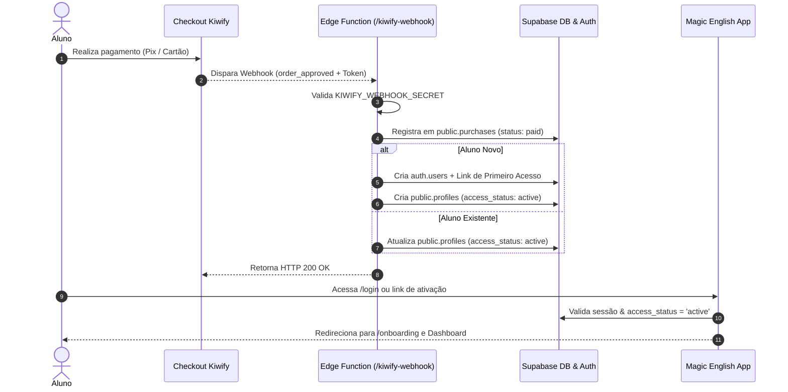

# 💳 GUIA OPERACIONAL: INTEGRAÇÃO KIWIFY EM PRODUÇÃO | MAGIC ENGLISH

Este documento fornece as instruções oficiais de configuração, homologação e manutenção da integração entre a **Kiwify** e a plataforma **Magic English (Supabase)**.

---

## 🌐 1. DADOS DE PRODUÇÃO

| Parâmetro | Valor de Produção |
| :--- | :--- |
| **Supabase Project ID** | `wrrtiewjritbhcfqzjhy` |
| **Supabase Project URL** | `https://wrrtiewjritbhcfqzjhy.supabase.co` |
| **Edge Function Endpoint** | `https://wrrtiewjritbhcfqzjhy.supabase.co/functions/v1/kiwify-webhook` |
| **Método HTTP** | `POST` |
| **Formato de Dados** | `application/json` |

---

## 🔐 2. SECRETS NECESSÁRIOS NO SUPABASE

As variáveis secretas devem ser configuradas exclusivamente no ambiente seguro do **Supabase Edge Functions** (nunca no frontend ou versionadas no GitHub):

1. **`KIWIFY_WEBHOOK_SECRET`**:
   - Token secreto definido por você para assinar as requisições da Kiwify.
   - *Exemplo*: `me_kiwify_prod_sec_984218`
2. **`SUPABASE_URL`**:
   - Injetado automaticamente pelo Supabase Runtime (`https://wrrtiewjritbhcfqzjhy.supabase.co`).
3. **`SUPABASE_SERVICE_ROLE_KEY`**:
   - Injetado automaticamente pelo Supabase Runtime ou configurado no painel Supabase em **Project Settings > API > service_role (secret)**.

### Como definir os Secrets via CLI:
```bash
npx supabase secrets set KIWIFY_WEBHOOK_SECRET=sua_chave_secreta_aqui --project-ref wrrtiewjritbhcfqzjhy
```

---

## 🚀 3. COMANDOS DE DEPLOY DA EDGE FUNCTION

Para publicar ou atualizar a Edge Function no Supabase:

```bash
# 1. Login no Supabase CLI (se necessário)
npx supabase login

# 2. Vincular ao projeto de produção
npx supabase link --project-ref wrrtiewjritbhcfqzjhy

# 3. Fazer o deploy da função kiwify-webhook
npx supabase functions deploy kiwify-webhook --no-verify-jwt --project-ref wrrtiewjritbhcfqzjhy
```

> **Nota sobre `--no-verify-jwt`**: O webhook da Kiwify é uma chamada externa máquina-para-máquina (server-to-server). A validação de segurança é feita internamente pelo token `KIWIFY_WEBHOOK_SECRET` contido no header `x-kiwify-signature` ou payload.

---

## ⚙️ 4. PASSO A PASSO NO PAINEL DA KIWIFY

1. Acesse o painel da Kiwify: [https://dashboard.kiwify.com.br](https://dashboard.kiwify.com.br).
2. No menu lateral, navegue até **Apps / Webhooks** ou **Configurações > Webhooks**.
3. Clique em **+ Criar Webhook**.
4. Preencha os campos conforme abaixo:
   - **Nome**: `Magic English — Liberação Automática de Alunos`
   - **URL do Webhook**: `https://wrrtiewjritbhcfqzjhy.supabase.co/functions/v1/kiwify-webhook`
   - **Produtos**: Selecione os produtos do Magic English (ou *Todos os produtos*).
   - **Eventos a Escutar**: Marque todos os eventos relevantes:
     - [x] Pedido aprovado (`order_approved`)
     - [x] Pedido pago (`order_paid` / `paid`)
     - [x] Aguardando pagamento (`waiting_payment`)
     - [x] Pedido reembolsado (`order_refunded` / `refund`)
     - [x] Pedido com chargeback / contestação (`order_chargedback` / `chargeback`)
     - [x] Assinatura cancelada (`subscription_canceled`)
5. No campo **Token / Assinatura Secreta**, insira o mesmo valor configurado no `KIWIFY_WEBHOOK_SECRET`.
6. Clique em **Salvar Webhook**.

---

## 🔄 5. CICLO DE VIDA E FLUXO DO ALUNO



---

## 🧪 6. COMO TESTAR EM HOMOLOGAÇÃO

### Enviar teste via `curl` (PowerShell / Terminal):

#### 1. Teste de Compra Aprovada:
```bash
curl -X POST https://wrrtiewjritbhcfqzjhy.supabase.co/functions/v1/kiwify-webhook `
  -H "Content-Type: application/json" `
  -H "x-kiwify-signature: me_kiwify_prod_sec_984218" `
  -d '{
    "order_id": "kw-prod-teste-001",
    "order_status": "paid",
    "webhook_event_type": "order_approved",
    "product_name": "Magic English VIP Pro",
    "Customer": {
      "full_name": "Aluno Teste Producao",
      "email": "teste.producao@magicenglish.com",
      "mobile": "+5511999999999"
    },
    "Commissions": { "charge_amount": 29700 }
  }'
```

#### 2. Teste de Reembolso:
```bash
curl -X POST https://wrrtiewjritbhcfqzjhy.supabase.co/functions/v1/kiwify-webhook `
  -H "Content-Type: application/json" `
  -H "x-kiwify-signature: me_kiwify_prod_sec_984218" `
  -d '{
    "order_id": "kw-prod-teste-001",
    "order_status": "refunded",
    "webhook_event_type": "order_refunded",
    "Customer": {
      "email": "teste.producao@magicenglish.com"
    }
  }'
```

#### 3. Teste de Token Inválido (Segurança 401):
```bash
curl -X POST https://wrrtiewjritbhcfqzjhy.supabase.co/functions/v1/kiwify-webhook `
  -H "Content-Type: application/json" `
  -H "x-kiwify-signature: token_falso" `
  -d '{"order_id": "kw-hack-001"}'
```

---

## 🔧 7. COMO REPROCESSAR UM EVENTO MANUALMENTE

Se um aluno reportar que comprou e não teve o acesso liberado imediatamente (ex: erro temporário de internet na Kiwify):

1. Acesse o **Kiwify Dashboard > Webhooks**.
2. Abra o histórico de entregas do webhook do pedido do aluno.
3. Clique em **Reenviar Webhook / Re-try**.
4. Como a Edge Function possui **Idempotência ativa**, o pedido será processado e o status em `public.profiles` será atualizado para `access_status = 'active'` sem gerar duplicidade.
